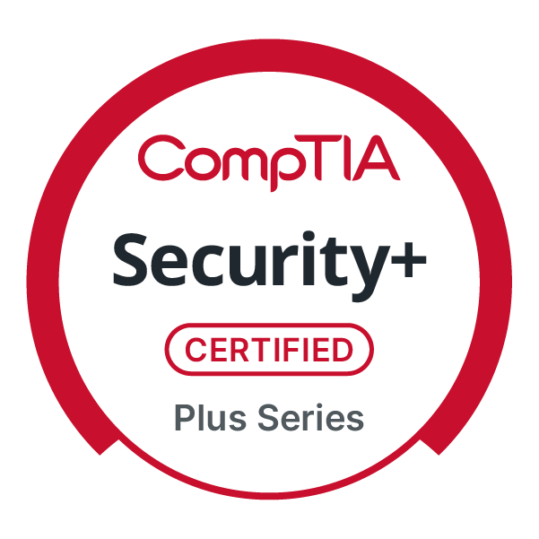
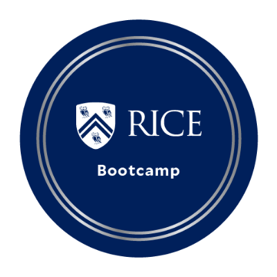

<h1>Hi, I'm Esteban!</h1>

<h2> Home Labs</h2>

  - [Brute Force SSH Attack & Detection Lab](https://github.com/e-salinas/SSH_BruteForce_LogAnalysis_Lab/tree/main)
  - [Python: Authentication System & Password Checker](https://github.com/e-salinas/Python_AuthenticationSystemandPasswordChecker)
    
<h2>📡 Cyber Bootcamp Projects</h2>

- [Splunk: Designing a monitoring solution](https://github.com/e-salinas/Boot_Camp_Projects/tree/main/Splunk_Monitoring)
- [Azure: Creating and securing a Web App](https://github.com/e-salinas/Boot_Camp_Projects/tree/main/Azure_WebApp_Lab)
 

<h2>📜 Certifications</h2>

<ul>
  <li>
    <a href="https://www.credly.com/badges/5316b1a9-f965-4b82-927f-82881234d4ab/public_url" target="_blank">
      
      <strong>[CompTIA Security+]</strong>
    </a>
  </li>
  <li>
    <a href="https://rice.credential.getsmarter.com/71d0eff4-a901-4654-8533-a136b9fd0f1f" target="_blank">
      
      <strong>[Rice University Cybersecurity Boot Camp]</strong>
    </a>
  </li>
</ul>

<h2> 🤳 Connect with me:</h2>

</body>
</html>
