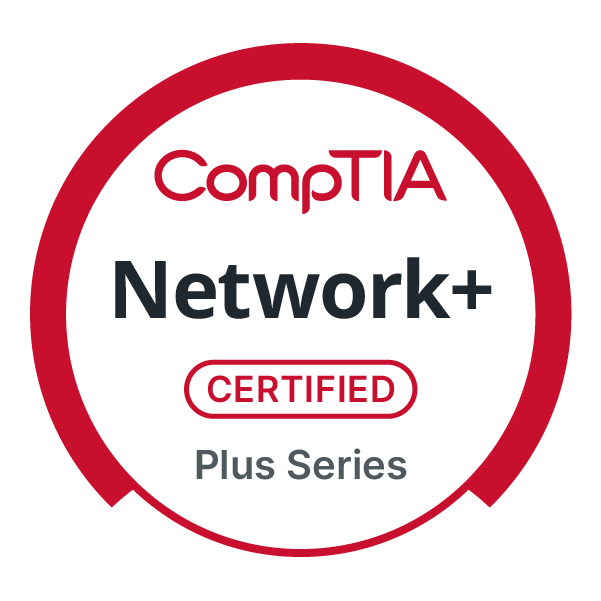

# Esteban Salinas

Security+ and Network+ certified IT professional building hands-on
experience in network deployment, technical support, and cybersecurity.

I bring more than 10 years of analytical and team-lead experience
supporting federal law-enforcement investigations. My technical projects
focus on configuring systems, troubleshooting problems, documenting
solutions, and investigating security events.

## Certifications & Training

<a href="https://www.credly.com/badges/3f472c34-0d15-4338-9335-daf92a138619/public_url">
  CompTIA Network+ (N10-009)
</a>

 

<a href="https://www.credly.com/badges/5316b1a9-f965-4b82-927f-82881234d4ab/public_url">
  CompTIA Security+ (SY0-701)
</a>

 

<a href="https://rice.credential.getsmarter.com/71d0eff4-a901-4654-8533-a136b9fd0f1f">
  Rice University Cybersecurity Boot Camp
</a>

## Networking

### [Network Deployment & Troubleshooting Lab](https://github.com/e-salinas/network-deployment-lab)

Built and troubleshot a Cisco Packet Tracer network using VLANs,
802.1Q trunking, router-on-a-stick, DHCP, inter-VLAN routing, and a
dedicated management VLAN.

**Skills:** Cisco IOS, VLANs, DHCP, subnetting, routing, switching,
connectivity testing, network documentation

## IT Support

### [osTicket IT Support Lab](https://github.com/e-salinas/osticket-lab)

Deployed osTicket and MariaDB with Docker and configured a fictional
organization with agents, users, departments, roles, SLAs, Help Topics,
and realistic support tickets.

**Skills:** Ticket management, troubleshooting documentation, Docker,
MariaDB, customer communication, escalation workflows

## Cybersecurity

### [Sentinel Lab](https://github.com/e-salinas/microsoft-sentinel-soc-lab)

Microsoft Sentinel SOC lab featuring Linux log ingestion, KQL-based threat detection, entity mapping, incident investigation, and NSG threat blocking.

**Skills:** Microsoft Sentinel, Microsoft Azure, SIEM, KQL, Log Analytics, incident response, threat detection

### [Wazuh SOC Homelab](https://github.com/e-salinas/wazuh-soc-homelab)

Created a defensive monitoring environment with a Wazuh manager,
monitored endpoint, and Kali attack system for alert investigation
and log analysis.

**Skills:** Wazuh, SIEM, Linux, endpoint monitoring, alert triage,
log analysis

## Technical Skills

- **Networking:** TCP/IP, VLANs, trunking, DHCP, DNS, subnetting,
  inter-VLAN routing, Cisco IOS
- **IT Support:** Ticket management, user support, troubleshooting,
  documentation, escalation
- **Security:** Wazuh, Splunk, Microsoft Sentinel, log analysis,
  incident response, vulnerability and compliance concepts
- **Systems:** Linux, Windows, Docker, MariaDB
- **Languages:** English and Spanish

## Connect with me

