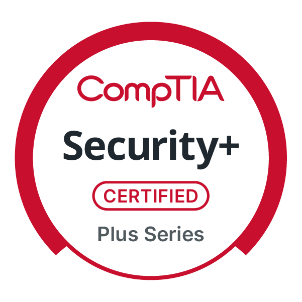
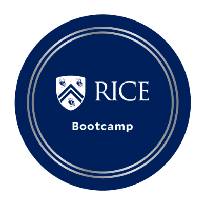

# Hi, I'm Esteban!

## 💻 About Me

Network + and Security+ certified language professional and actively transitioning into a technical role.  

I enjoy tackling technical challenges, exploring new technologies, and documenting my projects to share my progress. My goal is to continue developing my skills and contribute effectively to a team.

---

## 🏠 Home Labs

### 🆕 [SOC Analyst Homelab - Wazuh SIEM](https://github.com/e-salinas/soc-analyst-homelab)
Enterprise-grade Security Operations Center environment with real-time threat detection and incident response.

**Highlights:**
- 🛡️ Deployed Wazuh SIEM with multi-endpoint monitoring
- 📋 Professional incident reports with MITRE ATT&CK mapping
- 📘 Response playbooks following NIST framework

**Technologies:** `Wazuh` `Kali Linux` `Ubuntu` `Hydra` `Nmap` `UFW` `MITRE ATT&CK`

### ✅ [GRC Compliance Lab - CIS Benchmarks & NIST 800-53](https://github.com/e-salinas/grc-compliance-lab-wazuh)
Assessed Linux server compliance against CIS benchmarks using Wazuh SIEM. Analyzed 279 security checks, categorized findings by control family, and mapped results to NIST 800-53, PCI DSS, and HIPAA frameworks.

### 🛡️ [Microsoft Sentinel SIEM](https://github.com/e-salinas/Sentinel-Lab)

Configured end-to-end Azure security infrastructure including Resource Group, Log Analytics Workspace, Microsoft Sentinel, and Syslog data connector with custom data collection rules

### 🐧 [Linux Command-Line: Brute Force SSH Attack & Detection Lab](https://github.com/e-salinas/SSH_BruteForce_LogAnalysis_Lab)
- Used a Kali VM to simulate a brute-force attack in a controlled lab and did a log analysis to investigate the breach. 

---

## Pyhon Projects

### 🐍 [Python: Authentication System & Password Checker](https://github.com/e-salinas/Python_AuthenticationSystemandPasswordChecker)

---

## 🪖 Cyber Bootcamp Projects

- [Splunk: Designing a monitoring solution](https://github.com/e-salinas/Boot_Camp_Projects/tree/main/Splunk_Monitoring)
- [Azure: Creating and securing a Web App](https://github.com/e-salinas/Boot_Camp_Projects/tree/main/Azure_WebApp_Lab)

---

## 🌐 Localization Projects

- [React App Localization with Crowdin Integration](https://github.com/e-salinas/localization-app) – Demonstrates modern localization workflows using Crowdin for translation management, including continuous localization through automated GitHub integration.

---

## 📜 Certifications

- <a href="https://www.credly.com/badges/5316b1a9-f965-4b82-927f-82881234d4ab/public_url" target="_blank">
    
    [CompTIA Security+]
  </a>
- <a href="https://rice.credential.getsmarter.com/71d0eff4-a901-4654-8533-a136b9fd0f1f" target="_blank">
    
    [Rice University Cybersecurity Boot Camp]
  </a>

---

## 🤳 Connect with me

